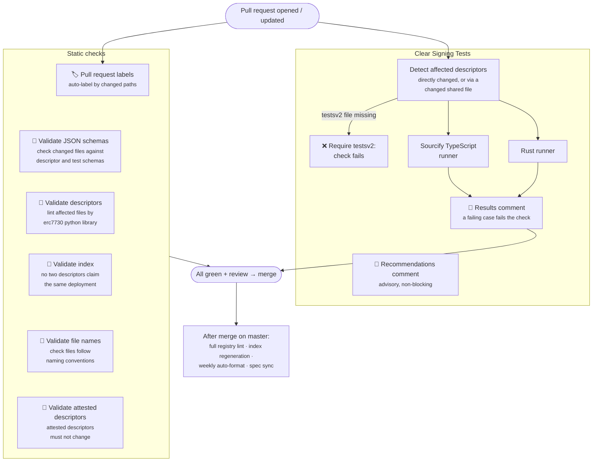

# CI checks on registry pull requests

Every pull request to the [ERC-7730 registry](https://github.com/ethereum/clear-signing-erc7730-registry) runs a set of automated checks. This page explains each check that matters when you add or change descriptors, what makes it pass or fail, and what happens after your PR is merged.

## The pipeline at a glance



## 🏷️ Pull request labels

*Workflow: `pull_request_labels.yml`*

Labels are applied automatically based on which paths the PR touches (`descriptors`, `specifications`, `documentation`, `ci`, `tools`), and the check requires **at least one** of these labels to be present. For a typical descriptor submission you don't need to do anything — changing files under `registry/` gets you the `descriptors` label automatically.

## 🔎 Validate JSON schemas

*Workflow: `pull_request.yml` → job `validate JSON schemas`*

Every changed JSON file under `registry/` and `ercs/` is validated with [`check-jsonschema`](https://check-jsonschema.readthedocs.io/) against the right schema:

| File | Schema |
|---|---|
| Descriptors and shared/common files | `specs/erc7730-v2.schema.json` (or the file's own relative `$schema` if it resolves) |
| `testsv2/*.tests.json` | `specs/erc7730-tests-v2.schema.json` |
| legacy `tests/*.tests.json` | `specs/erc7730-tests.schema.json` |
| `sigs/*` attestation files | skipped — no schema is defined for them yet |

This is a pure structural check — it catches missing required properties, wrong types, and typos in field names before the semantic linting even matters.

## 🔎 Validate descriptors (linting)

*Workflow: `pull_request.yml` → job `validate descriptors`*

Resolves the descriptors **affected** by the PR and runs the [`erc7730`](https://github.com/LedgerHQ/python-erc7730) linter on them:

```bash
erc7730 lint <affected descriptors> --gha
```

Affected means more than changed: a changed **shared file** (an `ercs/` template or a `common-*.json` file) is inlined into other descriptors via `includes`, so every descriptor whose includes chain contains it is linted too. Shared files are not linted standalone — they are partial descriptors, validated through their includers. Test fixtures and `sigs/` attestation files don't count as descriptors.

The registry uses the **v2 descriptor format**, so the v2 lint pipeline applies (auto-detected from the descriptors' `$schema`). The linter emits findings at two severities: **errors fail the check**, while **warnings** are annotated on the PR but let it pass. Each check below states which one it produces.

### What the linter checks in detail

`erc7730 lint` ([python-erc7730](https://github.com/LedgerHQ/python-erc7730), v2 pipeline) processes every descriptor in four phases — parsing, resolution, then a series of semantic linters:

#### 0. Parsing and resolution

Before any linter runs, the file must **load into the v2 descriptor model** (structural validation, stricter than the JSON schema alone) and **resolve**: `$ref` includes and shared/common files are inlined, constants substituted, and display paths parsed. Findings here (invalid function signatures in format keys, unresolvable references, malformed paths) are **errors — they fail CI** immediately.

#### 1. Display field validation (`ValidateDisplayFieldsLinter`)

For **calldata (contract) descriptors**, the linter fetches the contract's reference ABI from **Sourcify** (or Etherscan as fallback) for the declared deployments, then cross-checks the descriptor against it. Only the first finding is an error; the rest are warnings:

- **Error (fails CI) — invalid display field:** a display field's `path` does not exist among the function's ABI parameters. This catches typos and stale descriptors.
- **Warning — missing display field:** an ABI parameter has no display field. Every parameter should either be displayed or consciously excluded.
- **Warning — unknown selector:** the descriptor formats a function that does not exist in the reference ABI.
- **Warning — missing display format:** a function exists in the ABI but the descriptor defines no format for it (selector exhaustiveness — wallets fall back to blind signing for uncovered selectors).

If the contract looks like a **proxy**, ABI-based validation is skipped (with an info message). If no ABI can be fetched for any deployment, the linter warns and skips this validation — which is why contracts should be [verified on Sourcify](https://sourcify.dev) before submitting.

For EIP-712 descriptors this linter is a no-op (there is no embedded schema to check against in v2 — the format keys themselves are validated by the next linter).

#### 2. EIP-712 key validation (`ValidateEIP712KeysLinter`)

For **EIP-712 descriptors**, the `display.formats` keys must be exact [`encodeType`](https://eips.ethereum.org/EIPS/eip-712#definition-of-encodetype) strings (e.g. `Permit(address spender,uint256 value,uint256 nonce,uint64 deadline)`). Wallets match descriptors by the keccak256 hash of this string, so **any deviation means the descriptor silently never applies**. The linter checks, purely syntactically:

- the key matches the `encodeType` grammar exactly — no stray whitespace, balanced parentheses, members written as `type name` with single spaces;
- no struct type or member is defined twice;
- every member type is a valid EIP-712 atomic type (`uint8`–`uint256`, `bytes1`–`bytes32`, `bool`, `address`, `string`, `bytes` — the `uint`/`int`/`byte` aliases are **not** valid) or a struct defined in the key;
- every struct defined in the key is actually referenced from the primary type;
- referenced struct definitions are appended to the primary type **sorted by name**.

All findings from this linter are **errors — they fail CI**: a malformed key is a descriptor that will never match anything.

#### 3. Transaction type classification (`ClassifyTransactionTypeLinter`)

A safety net for common risky transaction types. The linter classifies the descriptor — for EIP-712, a format key containing `permit` marks it as a **Permit**; for contracts, classification runs on the fetched ABI — and then checks that the fields users need to see are actually displayed. For a Permit it flags a missing **spender**, **amount**, or **expiration/deadline** field. All findings are **warnings** — they don't fail CI, but expect reviewers to ask about them.

#### 4. Display length limits (`ValidateMaxLengthLinter`)

Hardware wallet screens are small. This linter warns when strings may be truncated on Ledger devices:

| What | Checked against |
|---|---|
| `metadata.owner`, `info.legalName`, `info.url`, contract `id` | creator/contract name limits |
| `intent`, `interpolatedIntent`, format `$id` | operation type limit |
| field `label`s (including nested groups) | field name limit |
| enum entries | enum value limit |

All of these are warnings — they don't fail CI, but shorter is better.

### Running the linter locally

Don't wait for CI — validate before you push:

```bash
pip install erc7730          # requires Python 3.12+, or: uvx erc7730 ...
erc7730 lint registry/<entity>/calldata-MyContract.json
```

## 🔎 Validate index

*Workflow: `pull_request.yml` → job `validate index`*

Rebuilds the registry [index](./reviewing-prs.md) in memory (`generate-index.js --validate`) and fails when it can no longer be generated:

- a `(chainId, address)` deployment is claimed by **more than one** calldata descriptor;
- two descriptors register the **same EIP-712 `encodeType`** at one address;
- an `includes` reference cannot be resolved.

This catches descriptor collisions — including a PR hijacking how another project's contract is displayed — *before* the merge; previously they only surfaced afterwards, when the index sync failed on `master`.

## 🔎 Validate file names

*Workflow: `pull_request.yml` → job `validate file names`*

Every file in an entity folder must be named `calldata-*.json`, `eip712-*.json`, or `common-*.json` (with the `tests/`, `testsv2/`, and `sigs/` subfolders having their own naming). Anything else fails the check with an annotation pointing at the [registry structure](https://github.com/ethereum/clear-signing-erc7730-registry#registry-structure) rules.

## 🔎 Validate attested descriptors

*Workflow: `pull_request.yml` → job `validate attested descriptors`*

[Attestations](../descriptors/creating-a-descriptor.md#attestations) bind to the exact content of a descriptor, so an attested descriptor is immutable. This check fails when a PR:

- **changes an attested descriptor** — directly, or transitively by editing a shared file that the attested descriptor `includes`;
- **deletes or renames an attested descriptor** — the file name is the bond between an attestation under `sigs/` and its descriptor, so an attestation must never be left without its descriptor.

The fix is always the same, and the error message says so: add a **new descriptor file** instead (the file name carries the version). The attestation stays valid for the old descriptor, and an auditor can attest the new one later.

## Clear Signing Tests (the testing workflow)

*Workflows: `clear-signing-tests.yml`, `clear-signing-tests-started.yml`, `clear-signing-tests-results.yml`*

Each descriptor added or changed in a PR must come with a **test file** at `registry/<entity>/testsv2/<descriptor-name>.tests.json`, containing sample transactions/messages and the exact display output a correct implementation must render for them (see [Reference test cases](../descriptors/creating-a-descriptor.md#4-write-reference-test-cases)).

The workflow runs for **every pull request, forks included** — the test runners consume no secrets, so there is no approval gate anymore. (The only wait is GitHub's standard rule that a first-time contributor's workflow runs need a maintainer's approval.) It works in three stages:

1. **Detection.** The workflow resolves the descriptors affected by the PR — directly changed ones, plus every descriptor whose `includes` chain contains a changed shared file — and looks for the matching `testsv2/` file of each (a changed test file likewise maps back to its descriptor).
2. **Test presence.** Every affected descriptor needs its own test file: the **Require testsv2 files** check fails and lists each descriptor that has none — one descriptor with tests cannot hide another without.
3. **Execution against reference implementations.** Each (descriptor, test file) pair is run against two independent ERC-7730 implementations:
   - the **Sourcify TypeScript runner** ([`@ethereum-sourcify/clear-signing`](https://github.com/sourcifyeth/clear-signing)), and
   - the **Rust runner** ([`llbartekll/clear-signing`](https://github.com/llbartekll/clear-signing)).

   The rendered output of every test case is compared against the `expected` block of the test file, and **a case that does not pass fails the runner's job** — the checks themselves give the verdict.

The results are also posted as a PR comment. When a run starts, a "⏳ tests are queued" note appears for the new commit; when it finishes, the note is replaced by a results table — one row per test case, one column per implementation, with expected-vs-got diffs for failures. (The comment is posted from the base repository after the run, because a fork's own run has a read-only token.) Every push re-runs the tests and refreshes the comment automatically.

Alongside the results, a separate advisory **recommendations comment** lists optional improvements for the changed descriptors: display formats without an `interpolatedIntent`, and the deprecated `context.contract.abi` / `context.eip712.schemas` fields. These are suggestions, not errors — they don't block the merge.

:::note
A third set of runners — Ledger device tests producing device screenshots — exists in the workflow but is currently disabled because it depends on a private Ledger repository. The Sourcify and Rust runners cover clear-signing tests in the meantime.
:::

## After the merge

A few workflows run on `master` and keep the registry consistent — you don't need to do anything for these, but you'll see their automated PRs:

- **Full registry lint** (`master.yml`) — every push to `master` re-lints *all* descriptors in the registry.
- **Index file sync** (`sync-indexes.yml`) — regenerates `index.calldata.json` and `index.eip712.json` from the descriptors and opens an automated PR when they change. The index files are **generated — never edit them by hand** in your PR.
- **Auto-formatting** (`format.yml`) — weekly `erc7730 format` run over the registry, opening a PR if anything was reformatted.
- **Spec sync** (`sync-specs.yml`) — weekly sync of `specs/erc-7730.md` and the JSON schemas from the upstream [ethereum/ERCs](https://github.com/ethereum/ERCs) repository, so the registry's copy of the spec follows the ERC.
