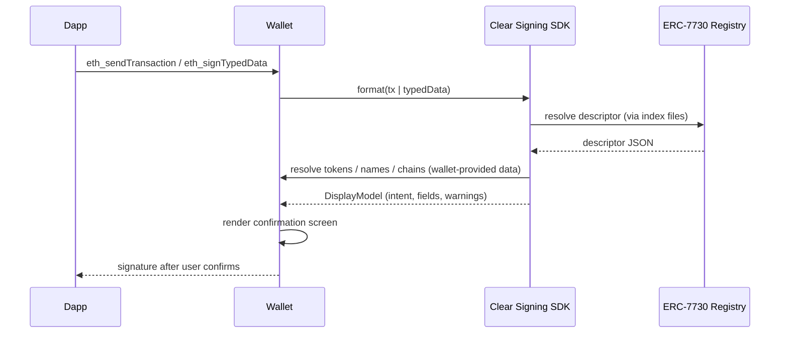

# Integrating clear signing into a wallet

To clear-sign, a wallet intercepts the signing request (`eth_sendTransaction`, `eth_signTypedData`, `wallet_sendCalls`), resolves the matching ERC-7730 descriptor from the [registry](https://github.com/ethereum/clear-signing-erc7730-registry), formats the payload into a display model, and renders that instead of raw data. You don't have to implement ERC-7730 yourself — there are SDKs that do the resolution and formatting, leaving your wallet the rendering and the data sources it already has (token lists, address book, RPC).

## The flow

Key concepts, common to all SDKs:

- **Descriptor resolution.** The registry publishes generated index files (`index.calldata.json`, `index.eip712.json`) mapping `(chainId, address)` — and for EIP-712, type hashes — to descriptor paths, so wallets find the right descriptor without downloading the whole registry.
- **External data.** Descriptors say *how* to format ("this is a token amount"), but the wallet supplies the data (token symbol and decimals, address names, chain info) from sources it trusts.
- **Display model.** The SDKs return a structured result: an `intent` (and preferably a fully substituted `interpolatedIntent` sentence — the recommended thing to show), an ordered list of labeled fields, contract metadata, and machine-readable warnings.
- **Fallbacks.** When no descriptor matches or data is missing, the SDKs degrade explicitly (warnings, raw calldata fallback) — your wallet decides how loudly to warn the user instead of silently blind-signing.

## Choose an SDK

### TypeScript — `@ethereum-sourcify/clear-signing`

For browser-extension, web, Node, and React Native wallets. The full integration guide is rendered in these docs:

**→ [TypeScript SDK integration guide](./typescript-sdk.md)**

Source: [sourcifyeth/clear-signing](https://github.com/sourcifyeth/clear-signing).

### Rust core with Swift & Kotlin bindings

For native mobile wallets (and Rust-based stacks), [llbartekll/clear-signing](https://github.com/llbartekll/clear-signing) provides a Rust ERC-7730 engine with UniFFI-based SDK surfaces and per-platform integration guides:

- [Swift integration](https://github.com/llbartekll/clear-signing/blob/main/docs/swift-integration.md) — Swift package with a handwritten `ClearSigningClient`
- [Kotlin / Android integration](https://github.com/llbartekll/clear-signing/blob/main/docs/kotlin-integration.md)
- [React Native integration](https://github.com/llbartekll/clear-signing/blob/main/docs/react-native-integration.md)

The same Rust engine also runs as one of the reference test runners in the [registry CI](../registry/ci-checks.md#clear-signing-tests-the-testing-workflow), alongside the TypeScript SDK — descriptors merged into the registry are verified against both.

## Display recommendations

Whichever SDK you use, ERC-7730 recommends:

1. **Prefer the interpolated intent** — a single substituted sentence like *"Approve 1,000 USDC for Uniswap V3"* — with the labeled fields available for full context. Fall back to `intent` + fields when no interpolated intent is available.
2. **Surface warnings.** Unknown token, unknown address, no descriptor matched — these are the cases where users get phished. Make degraded output look degraded.
3. **Show provenance where it helps** — the descriptor's `owner`/`contractName` ("Interacting with Uniswap V3") gives users an anchor for *who* they are dealing with.
